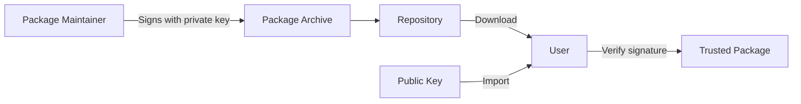

Zoi provides built-in security mechanisms to verify package integrity and authenticity through SHA-512 checksums and GPG signatures.

## Checksum Verification

Every package built with Zoi includes a SHA-512 checksum file that is automatically verified during installation.

### How Checksums Work

When you build a package, Zoi generates a `.hash` file:

```bash
zoi package build myapp.pkg.lua --type pre-compiled
```

**Output files:**

- `myapp-1.0.0-linux-amd64.pkg.tar.zst` - Package archive
- `myapp-1.0.0-linux-amd64.pkg.tar.zst.hash` - SHA-512 checksum

The hash file contains:

```
d8e8fca2dc0f896fd7cb4cb0031ba249334a7a0b7a4f5e6b8c3d2e1f0a9b8c7d6e5f4a3b2c1d0e9f8a7b6c5d4e3f2a1b0c9d8e7f6a5b4c3d2e1f  myapp-1.0.0-linux-amd64.pkg.tar.zst
```

### Automatic Verification

When installing a package, Zoi automatically verifies the checksum:

```bash
zoi install @zillowe/hello
```

**Installation output:**

```
✓ Resolved dependencies in 234ms
✓ Downloaded hello@1.0.0 (linux-amd64)
✓ Verified checksum (SHA512)
✓ Installed to ~/.zoi/pkgs/store/hello-1.0.0
```

If the checksum doesn't match, installation fails:

```
✗ Checksum verification failed for hello-1.0.0-linux-amd64.pkg.tar.zst
  Expected: d8e8fca2dc0f896fd7cb4cb0031ba249...
  Got:      a1b2c3d4e5f6a7b8c9d0e1f2a3b4c5d6...

This may indicate a corrupted download or tampered package.
Installation aborted.
```

<Warning>
  Never ignore checksum verification failures. They indicate the package may be corrupted or modified.
</Warning>

### Manual Verification

Verify checksums manually using the Zoi CLI:

```bash
# Calculate SHA-512 of a file
zoi check myapp-1.0.0-linux-amd64.pkg.tar.zst
```

Or use standard tools:

```bash
# Linux/macOS
sha512sum myapp-1.0.0-linux-amd64.pkg.tar.zst

# macOS (alternative)
shasum -a 512 myapp-1.0.0-linux-amd64.pkg.tar.zst

# Windows PowerShell
Get-FileHash myapp-1.0.0-linux-amd64.pkg.tar.zst -Algorithm SHA512
```

Compare the output with the contents of the `.hash` file.

## GPG Signature Verification

GPG (GNU Privacy Guard) signatures provide cryptographic proof that a package was built by a trusted maintainer and hasn't been tampered with.

### How GPG Signatures Work

1. **Package maintainer** signs the package with their private GPG key
2. **Zoi** verifies the signature using the maintainer's public key
3. **Installation proceeds** only if the signature is valid

This creates a **chain of trust** from the package repository to your system.

### Managing GPG Keys

Zoi includes a built-in PGP keyring with commands to manage public keys.

#### List Imported Keys

```bash
zoi pgp list
```

**Example output:**

```
Name: zillowe-official
Fingerprint: A1B2C3D4E5F6A7B8C9D0E1F2A3B4C5D6E7F8A9B0
User ID: Zillowe Official <contact@zillowe.qzz.io>
Status: Valid (expires 2026-12-31)

Name: community-maintainer
Fingerprint: 1A2B3C4D5E6F7A8B9C0D1E2F3A4B5C6D7E8F9A0B
User ID: Community Maintainer <maintainer@example.com>
Status: Valid (no expiration)
```

#### Import a Key from File

```bash
zoi pgp add --path maintainer-key.asc --name maintainer
```

#### Import a Key from URL

```bash
zoi pgp add --url https://example.com/keys/maintainer.asc --name maintainer
```

#### Import a Key from Keyserver

Fetch a key from keys.openpgp.org using its fingerprint:

```bash
zoi pgp add --fingerprint A1B2C3D4E5F6A7B8C9D0E1F2A3B4C5D6E7F8A9B0 --name maintainer
```

#### Remove a Key

```bash
# By name
zoi pgp remove maintainer

# By fingerprint
zoi pgp remove --fingerprint A1B2C3D4E5F6A7B8C9D0E1F2A3B4C5D6E7F8A9B0
```

#### Search for a Key

```bash
zoi pgp search maintainer@example.com
```

#### Show a Key's Public Key Data

```bash
zoi pgp show maintainer
```

### Built-In Keyring

Zoi ships with pre-installed public keys for the official Zoidberg registry. These keys are automatically used to verify packages from `@zillowe`.

Keys are stored in:

- **User scope:** `~/.zoi/pgps/`
- **System scope:** `/etc/zoi/pgps/` (Linux/macOS) or `C:\ProgramData\zoi\pgps\` (Windows)

### Signing Packages

Package maintainers sign packages during the build process:

<Steps>
  <Step title="Generate a GPG key pair">
    If you don't have a GPG key:

    ```bash
    gpg --full-generate-key
    ```

    Choose:
    - Key type: RSA and RSA
    - Key size: 4096 bits
    - Expiration: Set an expiration date (recommended)
    - Name and email: Your real name and email
  </Step>

  <Step title="Export your public key">
    ```bash
    gpg --armor --export your-email@example.com > your-key.asc
    ```

    Share this public key with users (e.g., in your repository README or on a keyserver).
  </Step>

  <Step title="Import your key into Zoi">
    ```bash
    zoi pgp add --path your-key.asc --name your-name
    ```
  </Step>

  <Step title="Sign packages during build">
    ```bash
    zoi package build myapp.pkg.lua --type pre-compiled --sign your-name
    ```

    This creates a `.sig` file alongside the package archive:

    - `myapp-1.0.0-linux-amd64.pkg.tar.zst.sig`
  </Step>
</Steps>

### Verifying Signatures

Zoi automatically verifies signatures when installing packages, if a `.sig` file is present.

**Installation with signature verification:**

```bash
zoi install @custom/myapp
```

**Output:**

```
✓ Resolved dependencies
✓ Downloaded myapp@1.0.0
✓ Verified checksum (SHA512)
✓ Verified GPG signature (key: maintainer)
✓ Installed to ~/.zoi/pkgs/store/myapp-1.0.0
```

If the signature is invalid or the key is not trusted:

```
✗ GPG signature verification failed for myapp-1.0.0-linux-amd64.pkg.tar.zst
  Signature is invalid or key is not in keyring.
  
Installation aborted. Import the maintainer's public key:
  zoi pgp add --url https://example.com/maintainer.asc --name maintainer
```

#### Manual Signature Verification

Verify a signature manually:

```bash
zoi pgp verify --file myapp-1.0.0-linux-amd64.pkg.tar.zst \
               --sig myapp-1.0.0-linux-amd64.pkg.tar.zst.sig \
               --key maintainer
```

Or use GPG directly:

```bash
gpg --verify myapp-1.0.0-linux-amd64.pkg.tar.zst.sig \
             myapp-1.0.0-linux-amd64.pkg.tar.zst
```

## Chain of Trust

Zoi's security model relies on a web of trust:

1. **Official registry**: Packages in `@zillowe` are signed by the Zillowe team using keys bundled with Zoi
2. **Third-party repositories**: Maintainers sign packages with their own keys
3. **Users**: Import public keys from trusted sources to verify third-party packages

### Trust Workflow



1. Maintainer signs the package with their **private key**
2. Package and signature are uploaded to a repository
3. User downloads the package and **imports the maintainer's public key**
4. Zoi verifies the signature using the public key
5. If valid, the package is installed

<Note>
  Always obtain public keys from official sources (project website, keyserver, verified GitHub repository).
</Note>

## Best Practices

<AccordionGroup>
  <Accordion title="For Package Maintainers">
    - Always sign packages with a strong GPG key (4096-bit RSA recommended)
    - Set an expiration date on your GPG key and rotate regularly
    - Publish your public key on a keyserver (keys.openpgp.org)
    - Include your public key in your repository README
    - Keep your private key secure and never share it
  </Accordion>

  <Accordion title="For Package Users">
    - Only install packages from trusted repositories
    - Import public keys from official sources
    - Verify key fingerprints before importing
    - Be cautious of packages without signatures
    - Regularly update your keyring (`zoi pgp list` to check for expiring keys)
  </Accordion>

  <Accordion title="For Repository Administrators">
    - Require all packages to be signed
    - Maintain a list of trusted maintainer keys
    - Revoke and remove compromised keys immediately
    - Document key management procedures for contributors
  </Accordion>
</AccordionGroup>

## Security Checklist

Before installing packages from a new repository:

- [ ] Verify the repository is from a trusted source
- [ ] Check if packages are signed (`*.sig` files present)
- [ ] Import the maintainer's public key from an official source
- [ ] Verify the key fingerprint matches the published fingerprint
- [ ] Check for recent commits and active maintenance
- [ ] Review the `.pkg.lua` file for suspicious commands

## Troubleshooting

### "Key not found" Error

If you see a key not found error during installation:

```bash
# Find the required key name/fingerprint in the error message
# Import the key from the maintainer's website or repository
zoi pgp add --url https://example.com/maintainer.asc --name maintainer

# Retry installation
zoi install @custom/package
```

### Expired or Revoked Keys

If a key has expired:

```bash
# Remove the old key
zoi pgp remove maintainer

# Import the renewed key
zoi pgp add --url https://example.com/maintainer-renewed.asc --name maintainer
```

### Checksum Mismatch

If checksums don't match:

1. **Re-download the package** - the download may have been corrupted
2. **Clear the cache** - `zoi cache clean`
3. **Verify the repository** - ensure you're using the correct repository URL
4. **Report the issue** - if the problem persists, notify the package maintainer

## Next Steps

<CardGroup cols={2}>
  <Card title="Creating Packages" icon="box" href="/guides/creating-packages">
    Learn how to build packages with Zoi
  </Card>
  <Card title="Publishing Packages" icon="upload" href="/guides/publishing-packages">
    Publish signed packages to repositories
  </Card>
  <Card title="Repositories" icon="git" href="/repositories">
    Manage package repositories
  </Card>
  <Card title="PGP Command Reference" icon="key" href="/commands/all-commands#pgp">
    Complete PGP command documentation
  </Card>
</CardGroup>
